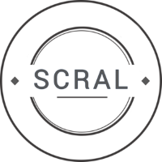

# SCRAL - Smart City Resource Adaptation Layer

[](https://opensource.org/licenses/BSD-2-Clause)





## Getting Started
*SCRAL* is a tool for [...]

### Install
SCRAL requires Python 3 or greater (it was tested on Python 3.7 so it is suggested to install at least that version).

#### Clone the repository
```
git clone https://git.pertforge.ismb.it/monica/scral-python-3
```

#### Libraries
Here insert possible necessary libraries.

#### Python packages
To install the required python3 packages:
```
pip3 install -r requirements.txt
```


### How to use SCRAL
```
        _____ __________  ___    __                                     
       / ___// ____/ __ \/   |  / /                                     
       \__ \/ /   / /_/ / /| | / /                                      
      ___/ / /___/ _, _/ ___ |/ /___   Smart City Resource Adaptation Layer                                 
     /____/\____/_/ |_/_/  |_/_____/   v2.0 - enhanced by Python 3

     (c) 2019, LINKS Foundation
     developed by Jacopo Foglietti & Luca Mannella


usage: SCRAL [-h] [-v] [-o OGC_FILE] [-c CONNECTION_FILE] [-p PILOT]

Smart City Resource Adaptation Layer

optional arguments:
  -h, --help            show this help message and exit
  -v, --verbose         enable verbose mode
  -o OGC_FILE, --ogc OGC_FILE
                        the path of the OGC configuration file
  -c CONNECTION_FILE, --conn CONNECTION_FILE
                        the path of the connection configuration
  -p PILOT, --pilot PILOT
                        the name of the desired pilot

example: start_module.py -v -f ./my_conf.conf -c external -p MOVIDA
  
```

More details about SCRAL implementation

### Examples
ex 1
```
./scral.py -h
```

ex 2
```
./scral.py -h
```

ex 3
```
./scral.py -h
```


## Other information
Insert here more relevant information.


## Next steps
SCRAL is still under active development. Several extensions will be available soon.

* nuova cosa 1
* nuova cosa 2
* nuova cosa 3


## Contacts
Feel free to contact [Jacopo Foglietti](http://ismb.it/jacopo.foglietti/) or [Luca Mannella](http://ismb.it/luca.mannella)
for any ideas, improvements, and questions.


## Licensing
**Copyright © 2019 [Jacopo Foglietti](http://ismb.it/jacopo.foglietti/)
and [Luca Mannella](http://ismb.it/luca.mannella) for [LINKS Foundation](http://linksfoundation.com/).**

*SCRAL* is licensed under the 2-Clause BSD License ([BSD-2-Clause](https://opensource.org/licenses/BSD-2-Clause)).
