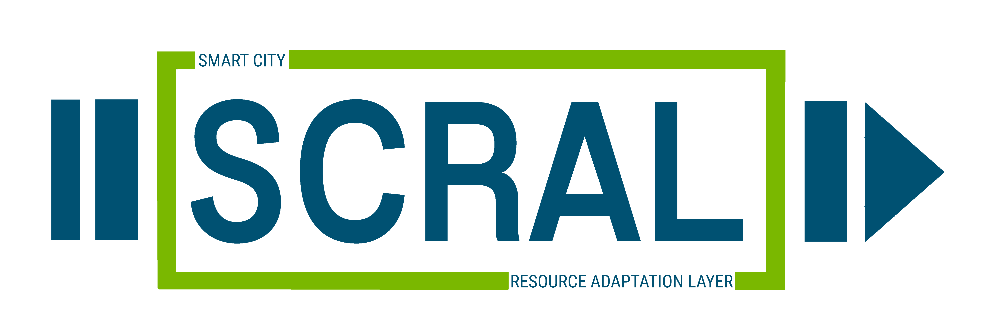

# SCRAL - Smart City Resource Adaptation Layer

[](https://opensource.org/licenses/BSD-2-Clause)




The Smart City Resource Adaptation Layer (*SCRAL*) is a framework used in MONICA european project to manage several
different kinds of IoT devices.


## Getting Started
This file was written to explain how you can run a SCRAL module already developed or how to develop your own.

If you would like to start a ready-to-use SCRAL Docker Container, you can have a look to the *quickstart* containers
that you can find on this [Docker Hub repository](https://hub.docker.com/r/monicaproject/scral).
SCRAL was tested mainly with Python 3.6 so it is suggested to install at least that version.

### How to use SCRAL
```
        _____ __________  ___    __                                     
       / ___// ____/ __ \/   |  / /                                     
       \__ \/ /   / /_/ / /| | / /                                      
      ___/ / /___/ _, _/ ___ |/ /___                                    
     /____/\____/_/ |_/_/  |_/_____/   Smart City Resource Adaptation Layer

     (c) 2017-2020, LINKS Foundation
     developed by Jacopo Foglietti & Luca Mannella


usage: SCRAL [-h] -p PILOT

arguments:
  -h, --help
        show this help message and exit
  -p PREFERENCES_FOLDER, --preferences PREFERENCES_FOLDER
        the name of the configuration folder

example: start_module.py -p MOVIDA  
```

Have a look to config folder to find more details about SCRAL configuration parameter.

### Examples
To better understand the MONICA environment and the SCRAL framework, you can have a look to the tutorials contained 
on the official [MONICA website](https://monica-project.github.io/). In particular, to start using SCRAL it is suggested
to follow [this tutorial](https://monica-project.github.io/sections/scral-deploy.html), meanwhile to start developing
your own SCRAL module, you can read [this other tutorial](https://monica-project.github.io/sections/scral-develop.html).

## Deployment
To deploy a new SCRAL image, modify to your needs one of the dockerfile already contained in each module folder.

### Docker
To start using SCRAL is strongly suggest to take a Docker image *"as is"* and to configure properly the environmental
variables. <br> An update list of the configurable variable is available in the
[Docker hub repository](https://hub.docker.com/r/monicaproject/scral).

## Prerequisites

### Download or Fork SCRAL repository.
The SCRAL source code is available in [MONICA project repository](https://github.com/MONICA-Project/scral-framework).
It is possible to fork (or simply download) the repository and start working directly on the source code.

### Docker
To start working with SCRAL is necessary to have Docker installed on your machine.
To install the proper version for your operating system, have a look to the 
[Docker documentation page](https://docs.docker.com/).

### GOST
SCRAL depends on the GOST server, a [Go](https://golang.org/) implementation of the Sensing OGC
[SensorThings API](http://developers.sensorup.com/docs).
To learn more about OGC and GOST visit the [GOST GitHub page](https://github.com/gost/server) or the MONICA tutorial
about [OGC Historical Data Retrieval & Visualizations](https://monica-project.github.io/sections/gost_retrieval.html).

To start GOST, you need the docker-compose file that you can download from
[GOST repository](https://github.com/gost/docker-compose) or the file "docker-compose-gost.yml" contained inside the
"docker-compose" folder of SCRAL repository.
Once you have the file, from the directory in which the file is stored, you can execute the following command:
```bash
$ docker-compose -f docker-compose-gost.yml up -d
```

### Python Packages
To work properly SCRAL requires the following Python packages (with the recommended versions):
 - [Eclipse Paho](https://pypi.org/project/paho-mqtt/1.5) 1.5
 - [Flask](https://pypi.org/project/Flask/1.0.2) 1.0.2
 - [CherryPy](https://pypi.org/project/CherryPy/18.1.0) 18.1.0
 - [arrow](https://pypi.org/project/arrow/0.14.2) 0.14.2 (arrow 0.15 not supported)
 - [requests](https://pypi.org/project/requests/2.22.0) 2.22.0
 - [configparser](https://pypi.org/project/configparser/3.7.1) 3.7.1

### Test
SCRAL does not have at the moment a test suite.<br>
Feel free to contribute if you want! :)

### Build
SCRAL is mainly written in Python 3 (that is an interpreted language) and so it could just be started without building anything.

## Contributing
Contributions are welcome. 

Please fork, make your changes, and submit a pull request. For major changes, please open an issue first and discuss it with the other authors.

## Licensing
**Copyright © 2017-2020 [Jacopo Foglietti](http://ismb.it/jacopo.foglietti/)
and [Luca Mannella](http://ismb.it/luca.mannella) for [LINKS Foundation](http://linksfoundation.com/).**

*SCRAL* is licensed under the Apache 2 License (click [here](https://opensource.org/licenses/Apache-2.0) for details).

## Affiliation
  
This work is supported by the European Commission through the [MONICA H2020 PROJECT](https://www.monica-project.eu) under grant agreement No 732350.
